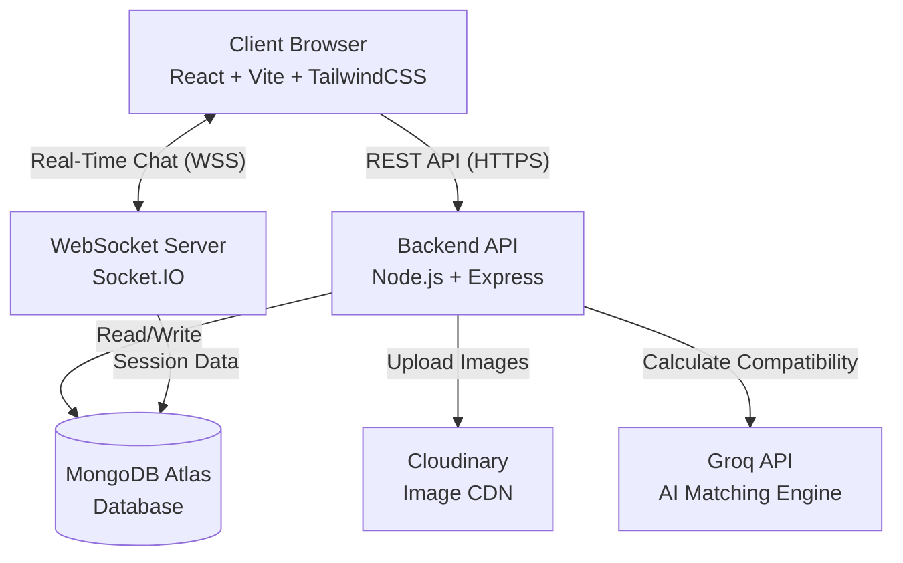

# 🏡 RentMate


**RentMate** is an advanced, full-stack MERN application designed to revolutionize the way people find rooms and flatmates. By leveraging AI-driven compatibility scoring, real-time messaging, and verified user profiles, RentMate eliminates the need for brokers and creates a seamless, secure ecosystem for both property owners and tenants.

---

## 🚀 Live Demo

- **Frontend:** [https://rentmate-one.vercel.app](https://rentmate-one.vercel.app)
- **Backend API:** Hosted on Render (Node.js/Express)

---

## ✨ Key Features

- **🤖 AI Compatibility Matching:** Utilizes LLMs (Groq API) to analyze tenant lifestyle preferences, habits, and budgets to generate an intelligent match score.
- **💬 Real-Time Chat Engine:** Integrated Socket.IO for instant, secure communication between verified tenants and property owners.
- **🏠 Dual Portals:** Distinct dashboards and workflows for **Tenants** (looking for rooms/flatmates) and **Owners** (managing property listings).
- **🛡️ Secure Authentication:** JWT-based authentication with Role-Based Access Control (RBAC).
- **📸 Cloud Media Management:** Seamless image uploading and optimization via Cloudinary.
- **🔍 Advanced Filtering:** Dynamic search capabilities filtering by location, budget, room type, and lifestyle habits.

---

## 🏗️ System Architecture

RentMate follows a robust Client-Server architecture utilizing the MERN stack.



---

## 💻 Tech Stack

### Frontend
- **Framework:** React 18 (via Vite)
- **Styling:** TailwindCSS
- **Routing:** React Router v6
- **Icons:** Lucide React

### Backend
- **Runtime:** Node.js
- **Framework:** Express.js
- **Real-Time:** Socket.IO
- **Authentication:** JSON Web Tokens (JWT) & bcryptjs

### Database & External Services
- **Database:** MongoDB Atlas (Mongoose ODM)
- **AI Engine:** Groq API (LLM-based compatibility scoring)
- **Media Storage:** Cloudinary

---

## 🛠️ Local Development Setup

To run RentMate locally, follow these steps:

### 1. Clone the repository
```bash
git clone https://github.com/shivamrajiwade333/Rentmate.git
cd Rentmate
```

### 2. Setup the Backend
```bash
cd server
npm install
```
Create a `.env` file in the `server` directory with the following variables:
```env
PORT=5000
MONGO_URI=your_mongodb_connection_string
JWT_SECRET=your_jwt_secret
JWT_EXPIRES_IN=7d
GROQ_API_KEY=your_groq_api_key
CLOUDINARY_CLOUD_NAME=your_cloudinary_name
CLOUDINARY_API_KEY=your_cloudinary_api_key
CLOUDINARY_API_SECRET=your_cloudinary_api_secret
```
Start the server:
```bash
npm run dev
```

### 3. Setup the Frontend
Open a new terminal window:
```bash
cd client
npm install
```
Start the Vite development server:
```bash
npm run dev
```

---

## 👨‍💻 Author
**Shivam Rajiwade**
- GitHub: [@shivamrajiwade333](https://github.com/shivamrajiwade333)

*Built as a showcase of advanced full-stack capabilities, modern UI/UX principles, and scalable system design.*
